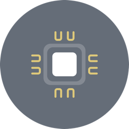

# UUID Plugin

___RFC 4122-compliant v5 UUID generator for your [Corona](https://coronalabs.com) games and applications.___

The __UUID__ plugin allows you to generate universally unique identifiers. Includes special methods for saving and loading UUIDs on the device, as well as, creating batches.

---

## Get the Plugin

If you don't already have it, get the __UUID__ plugin from the __[Corona Marketplace](https://marketplace.coronalabs.com/plugin/uuid)__.

---

## Add the Plugin

Add the plugin by adding an entry to the __plugins__ table of __build.settings__ file:

```
settings =
{
    plugins =
    {
        ["plugin.uuid"] =
        {
            publisherId = "com.develephant"
        },
    },
}
```

---

## Require the Plugin

```lua
local UUID = require("plugin.uuid")
```

---

You're all set to go! Have a look at the __[API](/api)__ documentation to start working with the plugin.